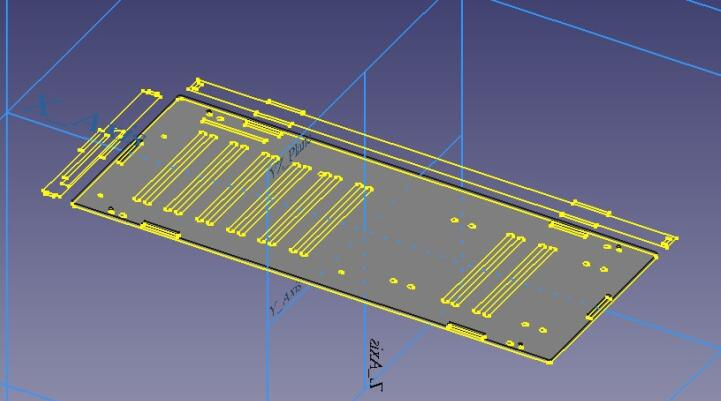

# FreeCAD Tutorial.《跟老卫学FreeCAD开发》

*FreeCAD Tutorial*, is a book about how to develop FreeCAD applications.

《跟老卫学FreeCAD开发》是一本 FreeCAD 应用开发的开源学习教程，主要介绍如何从0开始开发 FreeCAD 应用。本书包括最新版本 [FreeCAD 0.19.3](hhttps://wiki.freecad.org/) 中的新特性。图文并茂，并通过大量实例带你走近 FreeCAD 的世界！

本书业余时间所著，水平有限、时间紧张，难免疏漏，欢迎指正，

## Samples 示例

* keyboard-pc: 键盘主机

## Get start 如何开始阅读

选择下面入口之一：

* <https://github.com/waylau/freecad-tutorial> 的 [README.md](https://github.com/waylau/freecad-tutorial/blob/master/README.md)
* <https://gitee.com/waylau/freecad-tutorial> 的 [README.md](https://gitee.com/waylau/freecad-tutorial/blob/master/README.md)

## Code 源码

书中所有示例源码，移步至<https://github.com/waylau/freecad-tutorial>的 `samples` 目录下.

## Issue 意见、建议

如有勘误、意见或建议欢迎拍砖 <https://github.com/waylau/freecad-tutorial/issues>

## Contact 联系作者

* Blog: [waylau.com](http://waylau.com)
* Gmail: [waylau521(at)gmail.com](mailto:waylau521@gmail.com)
* Weibo: [waylau521](http://weibo.com/waylau521)
* Twitter: [waylau521](https://twitter.com/waylau521)
* Github : [waylau](https://github.com/waylau)

## Support Me 请老卫喝一杯

